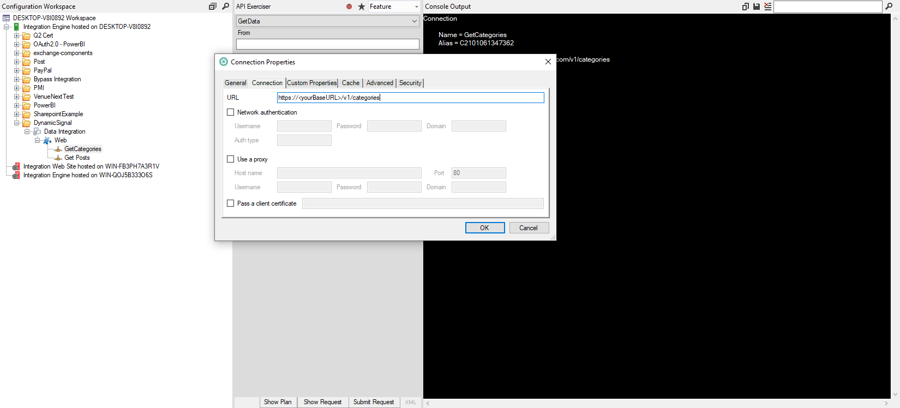

# Dynamic Signal Integration

## Description
Integration to Dynamic Signal for Four Winds Interactive resources.  This documentation is unlikely to be helpful if you are not an FWI employee.

## Getting Started

You'll need to identify the person on the client side who is a "Global Manager" within the Dynamic Signal platform.  That person will need to obtain and provide the Base URL and Bearer Token(s) necessary to make the API calls.

### Obtaining the `Bearer Token` and `Base URL`

These instructions are for the Dynamic Signal Global Manager.  Please feel free to forward them to that person or persons.

API Bearer tokens are generated by Global Managers on the [API Page](https://urldefense.com/v3/__https:/vermeertest.voicestorm.com/manage/api__;!!ICUevlz5aoA!7CEf8DRLQI1s89--0K1NtclwahDUGGOJ79EFwGqxpeXV1Xi7GNeNKVcuwYy32gM$).  This can be accessed by clicking Admin>Advanced>API.  The Base URL should also be on this page.

The Global Manager can then send the token and URL through their preferred secure method.  If over e-mail I recommend sending the token and URL in separate e-mails.

*Note: For certain API actions, the Dynamic Signal platform only accepts requests from the same origin as the community, or trusted domains that are defined in the Manager dashboard. You can add trusted domains at the bottom of the API page.*

## Implementing the Integration

Once you have the Bearer Token and BaseURL the setup is pretty easy.  You can start off by importing my example [IF adapter](https://fourwindsinteractivehq-my.sharepoint.com/:u:/g/personal/will_karges_fourwindsinteractive_com/EYmcFj_ofO9Gnsqf5iDUA6MBzyMRvvVdCdrK_1Rz7KB3Mg?e=wopmgK) (only available to FWI Employees) or just start from scratch.

First you'll need to create a new web adapter in IF.  At the connection enter in the Base URL provided by the client.

Save then right-click on the connection and select extended properties.  Enter `Bearer`|`<yourBearerToken` in the first and second Column.

### GET Categories

You'll first be using the [GET Categories](https://dev.dynamicsignal.com/api/Categories#get-categories) request so append `/v1/categories` to the end of your Base URL.  It should look like `https://<yourBaseURL>/v1/categories`.

Submit your request and you should get a list of categories in the response.  You'll need to identify the Category/Categories that the client wants to view posts from.  The first field of each Category node should contain the numeric category ID that you'll need for the next request.

### GET Posts

Once you've obtained your category ID(s) you'll need to duplicate your connection (copy it for as many different categories the client needs to pull posts from).

In your new connection, update the connection URL with the GET Post Categories request.  You'll need to add the id parameter with your category ID at the end of each connection URL.  Your URL should look something like this: `https://yourBaseURL/v1/posts/categories?id=yourIDnumber`

